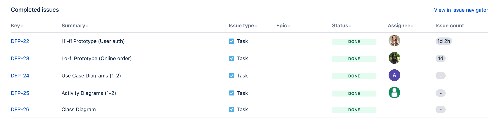

# Dan's Frappuccino Paradise
## _USU CS3450 Fall 2022_
- ### Andre Nguyen 
- ### Emily Thomas
- ### Karl Poulson
- ### Maris Hurst

Dan's Frappuccino Paradise is a web app powered by Django and Python
- Create and Manage Orders
- Modify Existing Menu Items
- Update existing customers and employees
## An explanation of the organization and name scheme for the workspace 
 - The organization of this project is composed of Emily Thomas as the agile scrum leader. Emily will be in charge of assigning and dividing tasks among the other team members.  Maris, Karl, and Andre will also be involved with the agile process, but mainly be focused on developing the software managed by Emily. 
 - Our team will have weekly meetings that will discuss what has been done and how our project is organized. At the moment, it seems that Karl is the back-end developer. Maris and Andre will mainly be involved with the front end.
 - Our workflow will consist of a git branching model. To develop a new feature or update the web application, each developer will need to fork, clone, and create a pull requests 

## Version-control procedures
 - Our version control will utilize Github. We will host our public repository there and use Git as our version control. 
 - For any new updates or features that will be added to the repository, the developer will fork the main repository and create a clone for their local machine. There, the developer will create a new branch with the feature and what task (from Jira) The developer will then merge that branch into a second main branch which will require 1-2 people to review the pull request before merging into the main branch. 
 - If the pull request is accepted by two reviewers, it will be merged into our develop branch (staging branch) where Emily will assign Andre to manually test the new feature. If the pull request passes our unit, build, and manual testing, it will be committed with a version number and pushed into our production branch (main)
 - If the pull request is not accepted by the reviewers, the Jira ticket that contains the feature or bug will be updated to include more information. The pull request will be denied and the creator of the pull request will be notified and assistance will be provided if needed. 
 - If the pull request fails the system test or our unit test, the same procedure will be implemented. The developer will be notified and feedback will be given until the pull request is accepted. 
 
## Tool stack description and setup procedure
- Python (Latest Version)
- Django Framework (Latest Version)
- Jira (Latest Version)
- Git (Latest Version)

## Build instructions
 - The web Server Gateway Interface will be our main deployment and build system for the Django Web Application 
 - WSGI is automatically configured for Django projects but will be modified if needed for custom build steps 
## Unit testing instructions
 - https://developer.mozilla.org/en-US/docs/Learn/Server-side/Django/Testing
 - Our Unit tests will be written according to the documentation above. The developer of the feature will be responsible for drafting test steps for the new feature for system testing. 
 1. Fork the repo
 2. Clone the repo down into the local machine 
 3. Create a new branch in feature and commit changes, push changes upstream to the local clone 
 4. Create a pull request into the development branch where two reviewers will be assigned to evaluate the changes 
 5. If accepted, draft test steps and place them in the Jira Ticket (Bug/Feature)
 6. Notify Andre that the pull request has been accepted. Andre will pull down the latest change from the development branch and start testing 
 7. If the tests pass, Andre will merge into the main branch. If previous tests or the current tests fails, Andre will reject the changes and send feedback to the developer. 
## System testing instructions
 - At the moment, Andre is assigned as our system tester. After a feature is accepted and merged into the development branch, Andre will manually test the feature and the entire application to ensure that the new merge did not create any bugs. If the system test passes, Andre will merge the development branch into the main branch. 
 - To run system tests, the developer of the feature or code will also be responsible for drafting some test steps for the tester to run. The test steps will be linked through Jira where Andre will be responsible for failing or passing the test. 
 
## Other development notes, as needed
### Milestone 2:
- Use case diagram: docs/Requirements.docx (Situation 9)
- UML Class diagram: docs/Class Diagram/UML.png
- Activity Diagrams: docs/Activities
- Lo-Fi/Hi-Fi prototypes: docs/Prototypes
- Hi-Fi prototype instructions: within the cloned directory, run $python manage.py runserver
    Then go to http://127.0.0.1:8000/playground/register in the browser and create a user (any username and password).
    This should redirect to /login where you can input your username and password once more, if successful it will take you to a HelloWorld landing page

